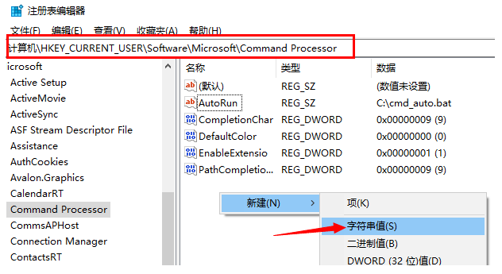
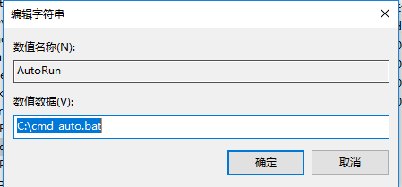

# 🤚

## cmd 配置别名

1. 新建 bat 文件  
   在某个目录下,新建文件`auto.bat` , 输入自己需要的常用命令的别名。  
   下面是我的 auto.bat：

   ```powershell
   @echo off
   doskey ls=dir /b $*

   doskey ys=yarn start
   doskey yd=yarn dev
   doskey yi=yarn
   doskey yb=yarn build

   doskey pd=pnpm run dev
   ```

   > 说明：  
   > doskey 相当于 Linux 中的 alias，等号左边是右边的别名；  
   > $\*表示这个命令还可能有其他参数；

2. 修改注册表，使 cmd 启动时自动执行该 bat 文件  
   win+r，键入`regedit`，进入地址：`计算机\HKEY_CURRENT_USER\Software\Microsoft\Command Processor，`右边空白处右键新建->字符串值。

   

   双击编辑该值，随便起个名字（比如 AutoRun），数值数据里填刚才新建的 bat 文件的路径（我的是 C:\\Users\\lenovo\\cmd_auto.bat）  
   

3. 确定后重启 cmd，别名就可以用了

## powershell 配置别名

在 PowerShell 中直接使用 Set-Alias 或 New-Alias 命令创建的别名在关闭此 Session 后即会失效，防止此现象的方法是将此命令写入 Windows PowerShell profile 文件。 查看此文件在计算机中的位置：

```powershell
PS C:\Users\my> $profile
C:\Users\my\Documents\WindowsPowerShell\Microsoft.PowerShell_profile.ps1
```

一般该文件在没有创建前是不存在的，使用以下命令为当前用户创建 profile 命令并返回文件地址：

```powershell
New-Item -Type file -Force $profile
```

打开文件写入别名函数代码：

```powershell
function CDLardock($path) {
    switch ($path) {
        'C' {
            $laradockPath = 'C:\Users\my\Documents\WindowsPowerShell'
            break
        }
        'J' {
            $laradockPath = 'D:\www\work'
            break
        }
        $null {
            $laradockPath = 'D:\www\laradock'
            break
        }
        default {
             if (-not (Test-Path -Path $path -PathType Container)) {
                throw "Invalid path: $path"
            }
            $laradockPath = $path
        }
    }
    Set-Location -Path $laradockPath
}
Set-Alias -Name Go -Value CDLardock

#function CDLardock {Set-Location -Path D:\www\laradock}
#Set-Alias -Name Go -Value CDLardock

# docIp container_name_or_id
function dockerIp($containerId) { docker inspect -f '{{range .NetworkSettings.Networks}}{{.IPAddress}}{{end}}' $containerId}
Set-Alias -Name docIp -Value dockerIp

function dockerAllIP { docker inspect -f '{{.Name}} - {{range .NetworkSettings.Networks}}{{.IPAddress}}{{end}}' $(docker ps -aq)}
Set-Alias -Name docAllIp -Value dockerAllIP

# function dockerUp {Go ; docker-compose up -d nginx mysql redis rabbitmq }
# Set-Alias -Name docUp -Value dockerUp

#  doc up / doc down / doc start / doc stop
function dockerOperation($operation) {
    Go ;
    if($operation -eq 'up'){
        docker-compose up -d nginx mysql redis rabbitmq php-worker
    }else{
        docker-compose $operation
    }
}
Set-Alias -Name doc -Value dockerOperation

function dockerExec($name){ Go ; docker-compose exec $name bash}
Set-Alias -Name exec -Value dockerExec

```

启动 PowerShell 提示 无法加载文件 C:\\Users\\xxx\\Documents\\WindowsPowerShell\\profile.ps1，因为在此系统上禁止运行脚本

```powershell
Windows PowerShell
版权所有（C） Microsoft Corporation。保留所有权利。

安装最新的 PowerShell，了解新功能和改进！https://aka.ms/PSWindows

. : 无法加载文件 C:\Users\my\Documents\WindowsPowerShell\Microsoft.PowerShell_profile.ps1，因为在此系统上禁止运行脚本。
有关详细信息，请参阅 https:/go.microsoft.com/fwlink/?LinkID=135170 中的 about_Execution_Policies。
所在位置 行:1 字符: 3
+ . 'C:\Users\my\Documents\WindowsPowerShell\Microsoft.PowerShell_profi ...
+   ~~~~~~~~~~~~~~~~~~~~~~~~~~~~~~~~~~~~~~~~~~~~~~~~~~~~~~~~~~~~~~~~~~~
    + CategoryInfo          : SecurityError: (:) []，PSSecurityException
    + FullyQualifiedErrorId : UnauthorizedAccess
```

输入 get-ExecutionPolicy 输出 Restricted

```powershell
PS C:\Windows\system32> get-ExecutionPolicy
Restricted
```

以管理员方式启动 PowerShell 输入 set-ExecutionPolicy RemoteSigned

```powershell
PS C:\Windows\system32> set-ExecutionPolicy RemoteSigned

执行策略更改
执行策略可帮助你防止执行不信任的脚本。更改执行策略可能会产生安全风险，如 https:/go.microsoft.com/fwlink/?LinkID=135170
中的 about_Execution_Policies 帮助主题所述。是否要更改执行策略?
[Y] 是(Y)  [A] 全是(A)  [N] 否(N)  [L] 全否(L)  [S] 暂停(S)  [?] 帮助 (默认值为“N”):

```

更换完成后，再次使用命令 get-ExecutionPolicy 查看脚本执行策略。

```powershell
PS C:\Windows\system32> get-ExecutionPolicy
RemoteSigned
```

重启 PowerShell

**我自己配置的**

```powershell
function yd {yarn dev}
function ys {yarn start}
function yi {yarn}
function yb {yarn build}


function pd {pnpm run dev}
function pi {pnpm install}
```
