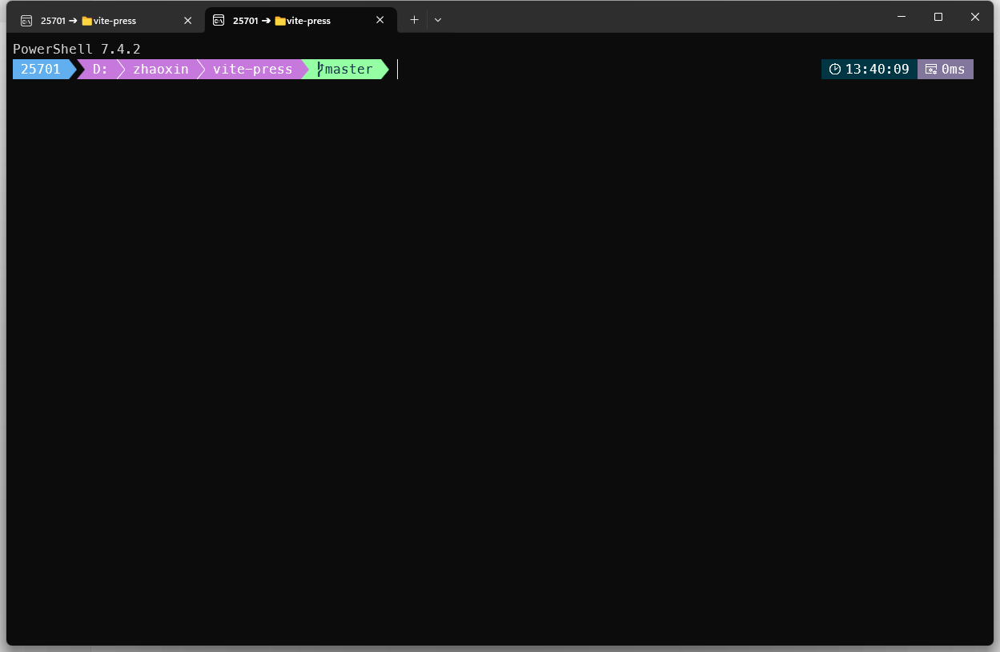
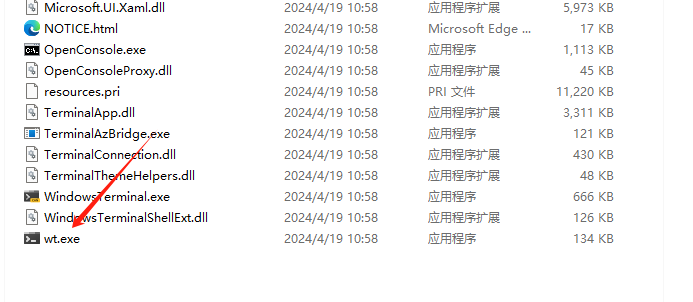
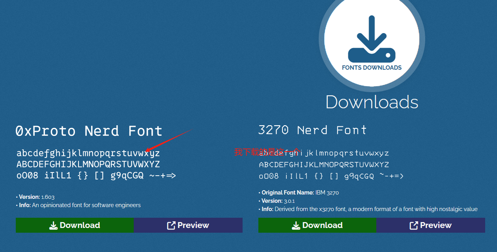
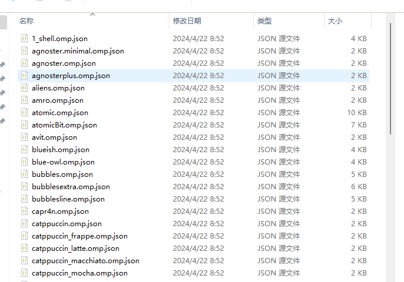
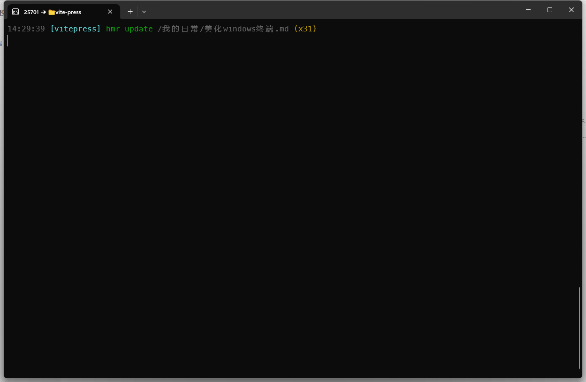

## 安装 Windows Terminal

 [下载地址](https://github.com/microsoft/terminal/releases)



>  一般来说win11会自带 我这次安装的是便携版本


## 安装PowerShell7

 [下载地址](https://learn.microsoft.com/zh-cn/powershell/scripting/install/installing-powershell-on-windows?view=powershell-7.4)

## 安装 ohmyposh

 [官网](https://ohmyposh.dev)

```powershell
Set-ExecutionPolicy Bypass -Scope Process -Force; Invoke-Expression ((New-Object System.Net.WebClient).DownloadString('https://ohmyposh.dev/install.ps1'))
```

这将安装：

- `oh-my-posh.exe`：Windows 可执行文件
- `themes`：最新的主题

查找软件安装位置

```powershell
where.exe oh-my-posh
```


## 下载字体

> 部分 Oh my posh 主题有一些特殊的字符，例如表示系统类型的徽标、GitHub 标志，这些字符需要特殊的字体支持。如果看上了一款有这些字符的主题，必须提前下载安装合适的字体，并将它们设置为终端显示的字体
>
> 这里推荐使用 [Nerd Fonts](https://sspai.com/link?target=https%3A%2F%2Fwww.nerdfonts.com%2F) 系列字体，它们在支持各种特殊字符的同时，设计也比较养眼

 [下载地址](https://www.nerdfonts.com/font-downloads)



## 下载主题

```
# 这里介绍最简单的本地配置
# 下载主题
Get-PoshThemes
# 最下面会显示主题存储位置，例如C:\Users\xxxx\AppData\Local\Programs\oh-my-posh\themes
```




## 修改默认字体

使用快捷键 `ctrl+shift+` 打开配置文件 修改默认字体

```json
"defaults": 
        {
            "font": 
            {
                "face": "MesloLGLDZ Nerd Font"
            }
        },
```

## 加载 ohmyposh

在`PowerShell_profile.ps1`写入以下内容 

> PowerShell_profile.ps1的由来请查看  [windows配置命令别名教程](./windows配置命令别名.md)

```powershell
C:\Users\25701\AppData\Local\Programs\oh-my-posh\bin\oh-my-posh.exe init pwsh --config 'C:\Users\25701\AppData\Local\Programs\oh-my-posh\themes\capr4n.omp.json' | Invoke-Expression
```

其中  `capr4n.omp.json` 就是主题文件 需要自己替换

 `C:\Users\25701\` 这一部分的目录需要按照自己的情况修改

#### 最终效果



